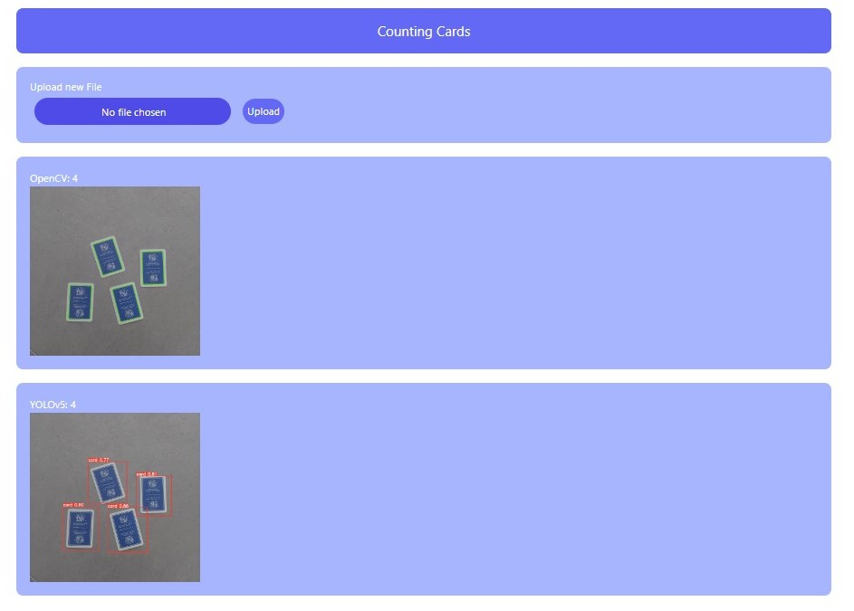
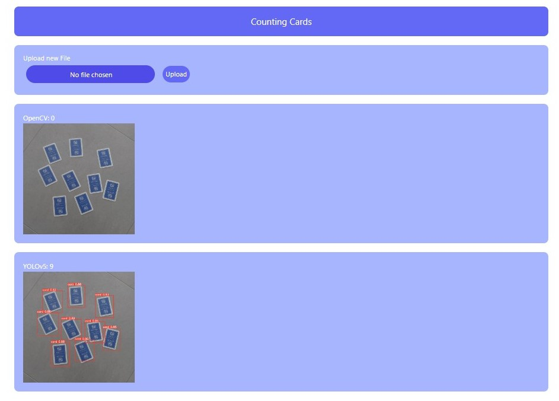

# Part 1
## Object counting con OpenCV
You will create a new conda environment `conda create -n <env-name> python=3.8`

`pip install opencv-python`
code in cv2_cards.ipynb

# Part 2
## Object detection with YOLO
- [CVAT](https://blog.roboflow.com/cvat/)
- We label data on CVAT
- Start a new CVAT task
- Create labels (we'll create just a label *card*)
- Upload the images
- Go to jobs
- Open the job
- Add rectangular shapes 
- Save
- Menu>Export Job Dataset>COCO 1.0
- Put images in the main folder (which also contains annotations folder)

[Roboflow](https://app.roboflow.com/) 
- Create a new public account
- Upload images
- Generate dataset (with augmentation)
- Select YOLOv5 format, then show download code

[Colab YOLOv5](https://colab.research.google.com/drive/1Brjw1h7C5Z-GEHnrVzQtn85lliqFmxMS?usp=sharing)
- replace curl URL from the one just created in Roboflow
- once trained, download the weights *best.py*. They are in `runs>train>yolov5_results>weights`. Keep them, we will use them later in the web app.

# Part 3
## Designing a web UI in Flask
Users will upload images, the application will return the number of objects found.
The Flask app is at `app.py`. It will return the template `index.html`. Uploaded pictures will be saved in `uploads`. Processed image is saved in `static\images`. **Notes**: change your local path to the folder.

How to run inference for YOLOv5?
- clone the *yolov5* repo `git clone https://github.com/ultralytics/yolov5`
- run `pip install -r requirements`
- we can download the folders with the training dataset locally with `!curl -L "<your roboflow dataset url>" > roboflow.zip; roboflow.zip; unzip roboflow.zip; rm roboflow.zip`
- adjust the absolute paths in `app.py` and `index.html`, to your local absolute paths for the images
- paste the weights we downloaded from Colab in `runs>train>yolov5_results>weights`

Now we can test the inference with `python app.py`. It will launch a development server at `127.0.0.1:5000`.
We can upload a local picture of cards and see the inference coming from both OpenCV and YOLOv5. We will see that OpenCV is not always accurate, while YOLOv5 works also under edge conditions, such as worse lighting. 

